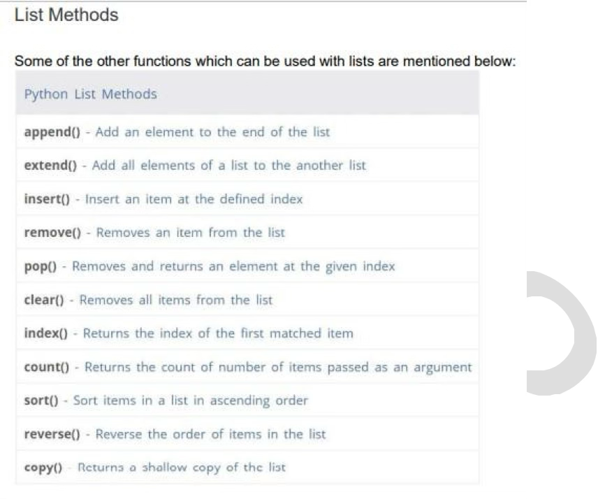

Question 1: Create empty,nested,integer lists:
```py
#empty list
empty_list=[]
#integer list
integer_list=[2,3,4]
#nested list
nested=[2,["hi",4.5]]
```

Question 2: Explain how indexing works in lists
```py
e_list=[2,3,12,8,5,1]
print(e_list[2]) 
# will print 12, as indexing starts from 0
n_list=[0,231,52,[2,3,5,1]]
print(n_list[3][2])
# will print 5
e_list=[2,3,12,8,5,1]
print(e_list[-2]) 
# prints 5
```

Question 3: using funtions on list
```py
e_list=[1,2,3,4]
e_list.append(2) 
# adds value 2 at the end
e_list.insert(3,5)
# adds number 5 at place value 3
e_list.extend([1,4,6])
# adds array to the end of list
e_list.pop()
# removes the last element
e_list.pop(2)
# removes the 2nd element
e_list.remove(2)
# removes the first instance of 2 in the list
```

Question 5: create tuple
```py
#empty tuple
empty_list=()
#integer tuple
integer_tuple=(2,3,4)
#mixed tuple
mixed_tuple=(2,"stuck",5)
```

Question 6: check if number is more or less than 0
```py
num = 3
if num > 0:
    print("more than 0")
if num < 0:
    print("less than 0")
```

Question 7: If user can vote or no
```py
num = int(input("age? "))
if num >= 18:
    print("you are eligible to vote")
else:
    print("no voting")
```

Question 8: line chart 
```py
import matplotlib.pyplot as plt 
date=["25/12", "26/12", "27/12"] 
temp=[8.5,10.5,6.81]
plt.plot(date, temp,marker='*',markersize=10,color='green',linewidth=2, linestyle='dashdot' ,markerfacecolor="y", markeredgecolor="r")
plt.xlabel("Date") 
#add the Label on x-axis plt. ylabel ("Temperature")
#add the Label on y-axis
plt.title("Date wise Temperature") 
#add the title to the chart plt. grid (True)
#add gridlines to the background
plt.show()
```



Question 9: bar chart 
```py
import matplotlib.pyplot as plt
# Manual data setup
labels = ('Python', 'Java', 'JavaScript', 'C#', 'PHP', 'C,C++', 'R')
sizes = [29.9, 19.1, 8.2, 7.3, 6.2, 5.9, 3.7]
plt.bar(labels,sizes)
# layout configuration
plt.ylabel('Usage in %')
plt.xlabel('Programming Languages')
# Save the chart file
plt.savefig('filename.png')
# Print the chart
plt.show()
```

Question 10: pie chart
```py
import matplotlib.pyplot as plt

Num= [35, 25, 25, 15]
Fruits=["Apples", "Bananas", "Cherries", "Dates"] 
myexplode = [0.2, 0, 0, 0] 
plt.pie(NUM,labels=Fruits,explode=myexplode, shadow = True)
plt.show()
```

Question 11: show image using cv
```py
import cv2
import matplotlib.pyplot as plt

# Read the image
image = cv2.imread("asda.jpg")

# Display the image
plt.imshow(image)
plt.show()
```

Question 12: convert how image looks like
```py
import cv2

img=cv2.imread("asda.jpg")
img_changed=cv2.cvtColor(img,cv2.COLOR_GRAY2RGB)

plt.imshow(img_changed)
plt.show()
```


Question 13: wait for key to close
```py
import cv2

img = cv2.imread('asda.jpg') 
cv2.imshow('Grayscale Image', img)
cv2.waitKey(0)
```

Question 14: plot a point
```py
import cv2
import matplotlib.pyplot as plt

img = cv2.imread('asda.jpg') 
plt.plot(500,22,marker="*",markersize=23)
plt.imshow(img)
plt.show()
```

Question 15: plot a line
```py
import cv2
import matplotlib.pyplot as plt

img = cv2.imread('asda.jpg') 
plt.plot(500,22,marker="*",markersize=23)
plt.imshow(img)
plt.show()
```

Question 16: plot two lines intersecting each other
```py
import cv2
import matplotlib.pyplot as plt

img = cv2.imread('asda.jpg') 
plt.plot([100,400],[500,100],[150,450],[100,400],marker="*",markersize=2)
plt.imshow(img)
plt.show()
```